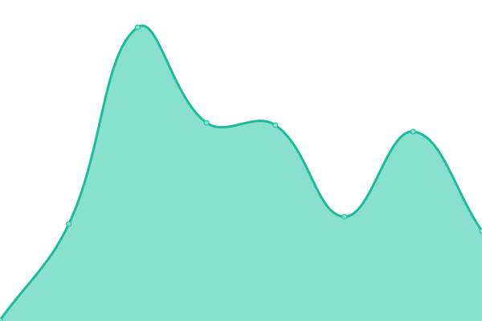
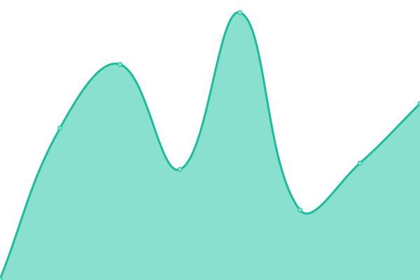
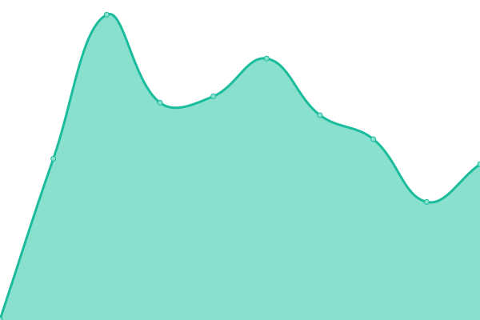
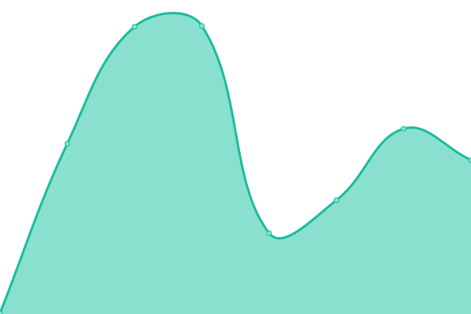

# [📈 Live Status](https://status.rocoawa.com): <!--live status--> **🟧 Partial outage**

This repository contains the open-source uptime monitor and status page for [Roco - Team](roco.work), powered by [Upptime](https://github.com/upptime/upptime).

With [Upptime](https://upptime.js.org), you can get your own unlimited and free uptime monitor and status page, powered entirely by a GitHub repository. We use [Issues](https://github.com/Roco-Team/stats/issues) as incident reports, [Actions](https://github.com/Roco-Team/stats/actions) as uptime monitors, and [Pages](https://status.rocoawa.com) for the status page.

<!--start: status pages-->
<!-- This summary is generated by Upptime (https://github.com/upptime/upptime) -->
<!-- Do not edit this manually, your changes will be overwritten -->
<!-- prettier-ignore -->
| URL | Status | History | Response Time | Uptime |
| --- | ------ | ------- | ------------- | ------ |
|  [Profile Page (roco.work)](https://roco.work/r.png) | 🟩 Up | [profile-page-roco-work.yml](https://github.com/Roco-Team/stats/commits/HEAD/history/profile-page-roco-work.yml) | 

 308ms
     
 | 

<a href="https://status.rocoawa.com/history/profile-page-roco-work">100.00%</a>
    

|  [Roco - Team (rocoawa.com)](https://rocoawa.com/) | 🟩 Up | [roco-team-rocoawa-com.yml](https://github.com/Roco-Team/stats/commits/HEAD/history/roco-team-rocoawa-com.yml) | 

 213ms
     
 | 

<a href="https://status.rocoawa.com/history/roco-team-rocoawa-com">100.00%</a>
    

|  [Archives (archived.roco.work)](https://archived.roco.work/) | 🟩 Up | [archives-archived-roco-work.yml](https://github.com/Roco-Team/stats/commits/HEAD/history/archives-archived-roco-work.yml) | 

 176ms
     
 | 

<a href="https://status.rocoawa.com/history/archives-archived-roco-work">100.00%</a>
    

|  [Blog (blog.roco.work)](http://blog.roco.work/) | 🟥 Down | [blog-blog-roco-work.yml](https://github.com/Roco-Team/stats/commits/HEAD/history/blog-blog-roco-work.yml) | 

 635ms
     
 | 

<a href="https://status.rocoawa.com/history/blog-blog-roco-work">31.26%</a>
    

|  [Images (img.roco.work)](https://img.roco.work/IMG_4010.jpg) | 🟩 Up | [images-img-roco-work.yml](https://github.com/Roco-Team/stats/commits/HEAD/history/images-img-roco-work.yml) | 

 233ms
     
 | 

<a href="https://status.rocoawa.com/history/images-img-roco-work">100.00%</a>
    

|  [URL Redirection (roco2.tk)](https://roco2.tk/) | 🟩 Up | [url-redirection-roco2-tk.yml](https://github.com/Roco-Team/stats/commits/HEAD/history/url-redirection-roco2-tk.yml) | 

 332ms
     
 | 

<a href="https://status.rocoawa.com/history/url-redirection-roco2-tk">100.00%</a>
    

|  [Team announcements (announce.rocoawa.com)](https://announce.rocoawa.com/) | 🟩 Up | [team-announcements-announce-rocoawa-com.yml](https://github.com/Roco-Team/stats/commits/HEAD/history/team-announcements-announce-rocoawa-com.yml) | 

 190ms
     
 | 

<a href="https://status.rocoawa.com/history/team-announcements-announce-rocoawa-com">100.00%</a>
    

|  [Navigation Page (w.roco.ml)](http://w.roco.ml/) | 🟩 Up | [navigation-page-w-roco-ml.yml](https://github.com/Roco-Team/stats/commits/HEAD/history/navigation-page-w-roco-ml.yml) | 

 528ms
     
 | 

<a href="https://status.rocoawa.com/history/navigation-page-w-roco-ml">100.00%</a>
    

<!--end: status pages-->

[**Visit our status website →**](https://status.rocoawa.com)

## 📄 License

- Powered by: [Upptime](https://github.com/upptime/upptime)
- Code: [MIT](./LICENSE) © [Roco - Team](roco.work)
- Data in the `./history` directory: [Open Database License](https://opendatacommons.org/licenses/odbl/1-0/)
